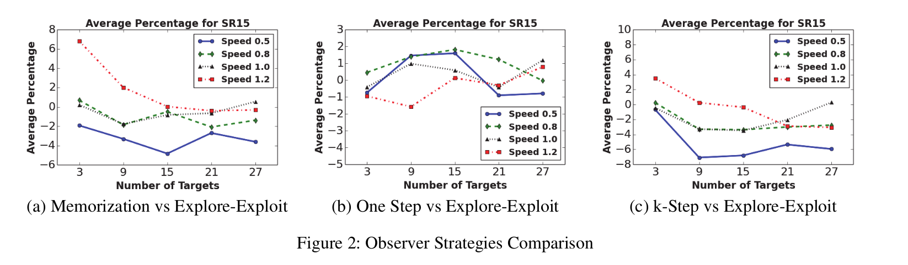

# CTOs:

## Avg targ observed for various alpha values (0.1 to 1)
avg = [6.16, 5.99, 5.82, 5.5, 5.69, 5.65, 5.4, 5.6, 5.6, 5.42]
Trend = Decreases till alpha = 0.4, then oscillates. 

**Straight line movement:** avg = [3.96, 5.71, 5.69, 5.75, 5.94, 5.52, 5.75, 5.83, 6.04, 6.09]
Trend - Sharp increase from alpha = 0.1 to alpha = 0.2, then slight increase. 
**Controlled Randomisation:** avg = [5.43, 6.11, 6.14, 5.9, 5.92, 5.5, 5.3, 5.26, 5.29, 5.43]
Trend - Sharp increase from alpha = 0.1 to alpha = 0.2, then decreases. 

**Explanation:**
- Lower values of alpha mean that the target moves slowly towards the target under observation. 
- Let us consider the scenario when two targets are under observation by an observer. Let's say one goes out of scope. Now the observer has only one target under observation. If alpha = 1, the observer now quickly moves towards the one target. The second target cannot come into the observer's scope again as the observer had moved far away from the target. 

**Original Paper:** 
avg = [4.39, 4.7, 5.57, 6.52, 6.69, 6.63, 6.66, 6.69, 6.73, 6.82]
Trend = increases till alpha = 0.4, then almost constant 

# Comparison of different explore exploit strategies

```
╒══════╒══════╤══════╤═══════╤═══════╤═══════╕
│Model │ 3    │ 9    │ 15    │ 21    │ 27    │
├──────├──────┼──────┼───────┼───────┼───────┤
│0-1   │ 1.88 │ 5.01 │  6.96 │  9.23 │ 10.74 │
├──────├──────┼──────┼───────┼───────┼───────┤
│0-.5-1│ 1.92 │ 5.27 │  7.5  │  9.53 │ 11.82 │
├──────├──────┼──────┼───────┼───────┼───────┤
│Model3│ 2.26 │ 5.26 │  8.09 │  9.74 │ 12.2  │
╘══════╘══════╧══════╧═══════╧═══════╧═══════╛
```

**Trend Comparison:**
1. Horizontally, the trend is the same as the original paper, with slightly higher scores for my model. 
2. For my model, 0-1 < 0-.5-1 < Model 3. but the original paper shows  0-.5-1 < model-3 <(almost =) 0-1 . But the order of magnitude of scores is same for both. 
   
**Explanation**:
- For the 0-1 model, if it finds a target, it exploits and follows the target. This does not give it room to explore while observing the target at the same time. 
- In case of model-3, it explores with some probability even when 1-2 targets are under its observation. This is due to its proper utilisation of the sensor range. Exploration allows it to come in contact with more targets, allowing it to maximise the score. 
- Randomised target strategy also contributes to this because the target does try to move away from the observers if it comes under observation. 


## Comparison of straight line randomisation probabilities
**NOTE:** 30% means 30% chance of straight line movement

```
╒══════╒══════╤══════╤═══════╤═══════╤═══════╕
│Props │ 3    │ 9    │ 15    │ 21    │ 27    │
├──────├──────┼──────┼───────┼───────┼───────┤
│30%   │ 1.74 │ 3.70 │  4.83 │  5.71 │  6.82 │
├──────├──────┼──────┼───────┼───────┼───────┤
│50%   │ 1.45 │ 3.18 │  4.26 │  5.42 │  6.26 │
├──────├──────┼──────┼───────┼───────┼───────┤
│70%   │ 1.27 │ 2.81 │  3.67 │  4.82 │  5.57 │
╘══════╘══════╧══════╧═══════╧═══════╧═══════╛
```

**Trend comparison:** 
1. The magnitude of scores of my model are around 60% of the original paper. 
2. In the original paper, the magnitude of scores is same for all the target movement strategies (fully randomised, 30%, 50%, 70%).
3. The original paper shows, fully randomised < 30% < 70% < 50%. My model shows 70% < 50% < 30% << fully randomised. 


## Target strategies comparison:


**Trend comparison:** 
1. Randomised strategy is 40-45% better than controlled randomised strategy and 20% better than straight line strategy, roughly. Originally, randomised strategy is better than straight line by 10-15% and better than controlled randomised by 5-10%. 
2. Straight line strategy is better than controlled randomised strategy by about 20-30%. Originally, controlled randomisation is better than straight line, but the margin depends on other factors (variable). 

## Observer strategies comparison:




**Trend comparison:** 
explore-exploit strategy is better than, 
1. memorisation by about 10% for high speeds and 20-30% for low speeds. Originally, for high speeds, memorisation is better while for low speeds, explore-exploit is better. 
2. onestep by 10%. Originally, both strategies seem to be equally good, with slight preference to explore-exploit. 
3. k-step by 12-20% for high speeds and 20-30% for low speeds. Originally, the margin is around 2-5%. 
